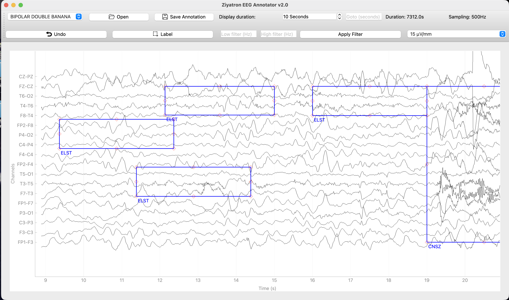
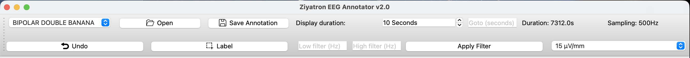
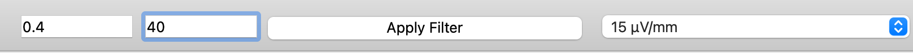
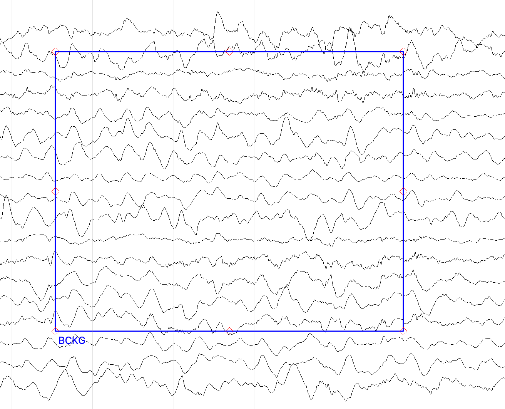
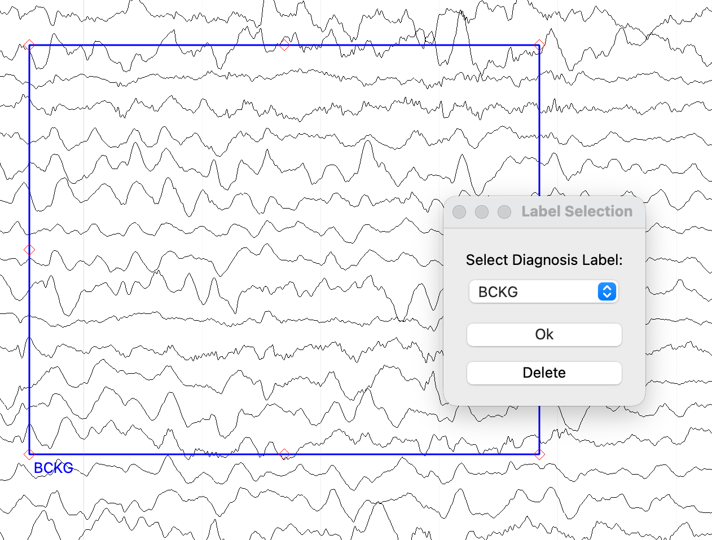
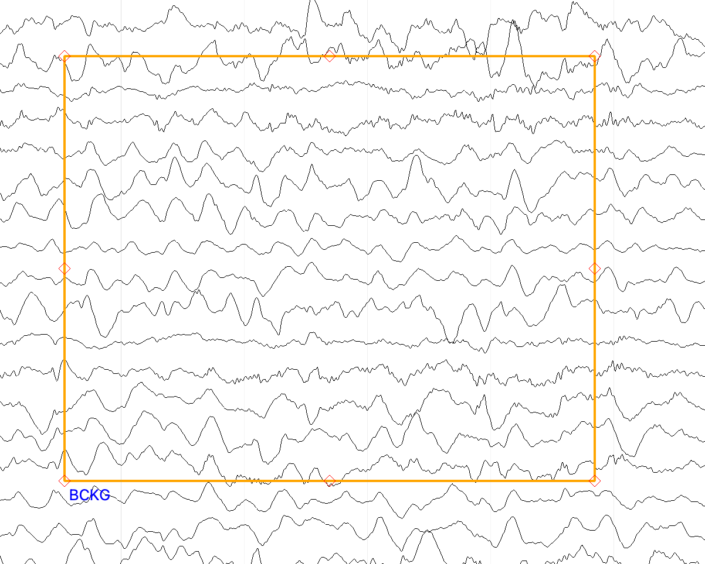
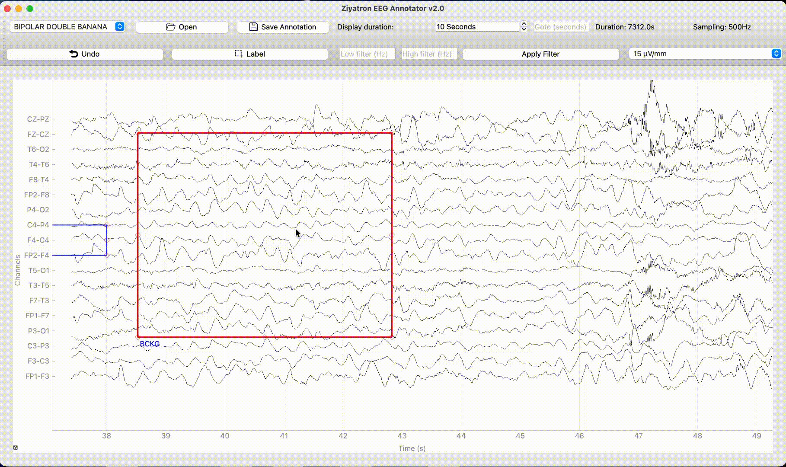
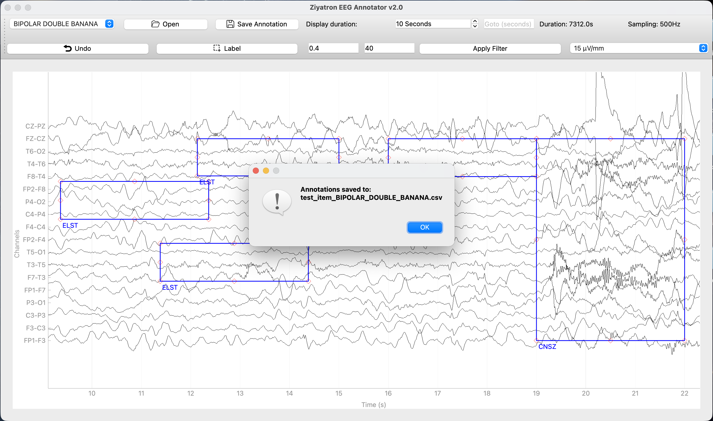

# Ziyatron EEG Annotator v2.0 — User Manual

**For neurophysiologists and clinical EEG reviewers**

---

## Table of Contents

1. [Getting Started](#1-getting-started)
2. [Interface Overview](#2-interface-overview)
3. [Opening an EEG File](#3-opening-an-eeg-file)
4. [Navigating the Recording](#4-navigating-the-recording)
5. [Display Settings](#5-display-settings)
6. [Annotation Workflow](#6-annotation-workflow)
7. [Annotation Labels Reference](#7-annotation-labels-reference)
8. [Saving and Loading Annotations](#8-saving-and-loading-annotations)
9. [Keyboard Shortcuts Reference](#9-keyboard-shortcuts-reference)

---

## 1. Getting Started

Ziyatron EEG Annotator loads EDF recordings and lets you mark, label, resize, move, copy, and save annotations as rectangular regions on the EEG trace. It streams data on demand so it stays fast even on large files.

**Supported files:** EDF and EDF+ (`.edf`)

---

## 2. Interface Overview





**Toolbar — top row:**
| Control | Purpose |
|---|---|
| Montage dropdown | Switch between electrode configurations |
| Open | Load an EDF file |
| Save Annotation | Write annotations to CSV |
| Display duration spinner | Set how many seconds are visible at once |
| Goto (seconds) | Jump to a specific time in the recording |
| Duration / Sampling labels | Shows file length and sampling frequency |

**Toolbar — bottom row:**
| Control | Purpose |
|---|---|
| Undo | Remove the most recently added annotation |
| Label | Enter annotation drawing mode |
| Low filter (Hz) | High-pass filter cutoff |
| High filter (Hz) | Low-pass filter cutoff |
| Apply Filter | Apply the entered filter values |
| Scale (µV/mm) | Adjust vertical amplitude of channels |

**Menu bar:** File → Open EDF, Save Annotations, Exit

---

## 3. Opening an EEG File

1. Click **Open** in the toolbar, or use **Ctrl+O** (Cmd+O on Mac).
2. Select an `.edf` file from the file browser.
3. The recording loads and displays the first 10 seconds.
4. If a matching annotation file already exists in the same folder, it is loaded automatically.

> **Note:** Only the visible time window is loaded into memory. The application does not load the entire file at once — it streams data as you navigate.

---

## 4. Navigating the Recording

### Panning

| Method | Action |
|---|---|
| **A** key | Pan left 10 seconds |
| **D** key | Pan right 10 seconds |
| Mouse drag on plot | Pan freely (click and drag on empty area) |
| Scroll wheel | Zoom in/out on the time axis |

### Jumping to a Specific Time

Type a time in seconds into the **Goto** field and press **Enter**. The view jumps to that position.

### Changing the Visible Window

Use the **Display duration** spinner to set how many seconds are shown at once (minimum 5 s, maximum half the total recording duration). The view re-centers on your current position.

---

## 5. Display Settings

### Montage

Select the electrode configuration from the montage dropdown. Available montages:

| Montage | Description |
|---|---|
| **AVERAGE** | Each electrode referenced to the average of all electrodes. 19 channels + ECG. |
| **BIPOLAR DOUBLE BANANA** | Sequential longitudinal bipolar pairs (FP1-F3, F3-C3, … standard clinical layout, 18 channels). |
| **BIPOLAR TRANSVERSE** | Lateral bipolar pairs across both hemispheres (18 channels). |

> Changing the montage reloads the data and redraws all annotations automatically. Your current time position is preserved.

### Amplitude Scale

The **Scale** dropdown sets vertical sensitivity in µV/mm. Available values:

`1 · 2 · 5 · 7 · 10 · 15 · 20 · 50 · 70 · 100 · 200 · 500 · 1000 µV/mm`

Lower values (e.g., 1 µV/mm) make signals appear taller. Higher values (e.g., 1000 µV/mm) compress them.

### Filtering



Enter frequency values in the **Low filter** and **High filter** fields, then click **Apply Filter**:

| Field | Effect |
|---|---|
| Low filter (Hz) | High-pass filter — removes slow drift below this frequency |
| High filter (Hz) | Low-pass filter — removes high-frequency noise above this frequency |
| Both empty | No filter applied |
| Low filter only | High-pass only |
| High filter only | Low-pass only |

> Applying a filter reloads the data. Your current time position is preserved.

---

## 6. Annotation Workflow


### 6.1 Drawing a New Annotation


1. Click the **Label** button in the toolbar (or press **L**). The cursor changes to a crosshair and the Label button becomes highlighted — you are now in drawing mode.
2. **Click and drag** on the plot to draw a rectangle over the region of interest. You can span multiple channels vertically and any time range horizontally.
3. Release the mouse button. The rectangle is created with the default label **BCKG**.
4. Drawing mode exits automatically after each annotation.



> **Minimum size:** The rectangle must be at least 0.2 seconds wide and span at least half a channel height. Clicks without dragging are ignored.

> **To cancel drawing** before releasing: press **Escape**.

### 6.2 Changing an Annotation's Label



**Right-click** any annotation rectangle. A dialog opens with:
- A dropdown listing all 44 diagnosis labels
- **OK** — apply the selected label
- **Delete** — remove this annotation entirely

### 6.3 Moving and Resizing Annotations

- **Drag the body** of a rectangle to move it.
- **Drag any handle** (small squares on the edges and corners) to resize it.
- Movement is constrained to the plot boundaries (0 to end of recording).

### 6.4 Selecting an Annotation



**Left-click** any annotation rectangle. Its border turns **orange** to indicate it is selected. Only one annotation can be selected at a time. Click on empty plot space to deselect.

### 6.5 Copying and Pasting Annotations



1. **Left-click** the annotation you want to copy (it turns orange).
2. Press **Ctrl+C** (Cmd+C on Mac) to copy it.
3. Move your mouse cursor to the desired time position in the plot.
4. Press **Ctrl+V** (Cmd+V on Mac) to paste.

The pasted annotation is identical to the original — same label, same channels, same duration — but its start time is set to the current cursor X position.

> **Notes:**
> - You can paste multiple times from the same copy.
> - If the pasted annotation would extend beyond the end of the recording, it is clamped to fit.
> - If the copied channels are not present in the current montage, the paste is silently skipped.

### 6.6 Deleting Annotations

| Method | Action |
|---|---|
| Right-click → Delete | Deletes the right-clicked annotation |
| Hover over annotation + **Delete** or **Backspace** | Deletes the annotation under the cursor |
| **Ctrl+Z** (Cmd+Z on Mac) or **Undo** button | Removes the most recently added annotation |

> The **Undo** button is enabled only when at least one annotation exists. It removes the last-added annotation, not the last-modified one.

---

## 7. Annotation Labels Reference

The following 44 labels are available in the label selection dialog:

### Background / General
| Label | Meaning |
|---|---|
| **BCKG** | Background (default label for new annotations) |
| **ARTF** | Artifact (general) |
| **INTR** | Intrusion |
| **SLOW** | Slowing |

### Rhythmic Patterns
| Label | Meaning |
|---|---|
| **AR** | Alpha rhythm |
| **BR** | Beta rhythm |
| **TR** | Theta rhythm |
| **DR** | Delta rhythm |
| **MR** | Mu rhythm |
| **AOR** | Alpha-like overdose rhythm |
| **DSR** | Delta slow rhythm |
| **PHS** | Photic stimulation |
| **SHW** | Spike-and-wave (high frequency) |
| **SPW** | Spike-and-wave |
| **GED** | Generalized epileptiform discharge |
| **LED** | Lateralized epileptiform discharge |
| **HPHS** | Hypsarrhythmia |
| **TRIP** | Triphasic waves |

### Eye / Muscle Artifacts
| Label | Meaning |
|---|---|
| **EYBL** | Eye blink |
| **EYEM** | Eye movement |
| **CHEW** | Chewing artifact |
| **SHIV** | Shivering artifact |
| **MUSC** | Muscle artifact |
| **EMA** | Electrode/movement artifact |
| **ELST** | Electrical stimulation |

### Seizure Types
| Label | Meaning |
|---|---|
| **SEIZ** | Seizure (general) |
| **FNSZ** | Focal non-specific seizure |
| **GNSZ** | Generalized non-specific seizure |
| **SPSZ** | Simple partial seizure |
| **CPSZ** | Complex partial seizure |
| **ABSZ** | Absence seizure |
| **TNSZ** | Tonic seizure |
| **CNSZ** | Clonic seizure |
| **TCSZ** | Tonic-clonic seizure |
| **ATSZ** | Atonic seizure |
| **MYSZ** | Myoclonic seizure |
| **NESZ** | Non-epileptic seizure |

### SSW / Patterns
| Label | Meaning |
|---|---|
| **ASSA** | Asymmetric SSW (type A) |
| **BSSA** | Bilateral SSW (type B) |
| **TSSA** | Temporal SSW |
| **DSSA** | Diffuse SSW |
| **NDAR** | Non-diagnostic abnormal rhythm |
| **CALB** | Calibration |
| **IFCN** | IFCN standard |

---

## 8. Saving and Loading Annotations

### Saving

Click **Save Annotation** in the toolbar or press **Ctrl+S** (Cmd+S on Mac).

Annotations are saved as a CSV file in the **same folder as the EDF file**, named:
```
{edf_filename}_{montage_name}.csv
```
Example: `patient_01_BIPOLAR_DOUBLE_BANANA.csv`



> **Important:** Annotations are montage-specific. Saving under one montage does not affect annotation files for other montages.

### Automatic Loading

When you open an EDF file, the application automatically searches for a matching annotation CSV in the same folder. If found, all annotations are loaded and displayed on the plot.

### CSV Format

Each row in the CSV represents one channel of one annotation:

| Column | Description |
|---|---|
| `channels` | Electrode channel name (e.g., `FP1-F7`) |
| `start_time` | Start time in seconds (integer) |
| `stop_time` | Stop time in seconds (integer) |
| `onset` | Diagnosis label (e.g., `SEIZ`) |

Multi-channel annotations are stored as multiple rows with the same time and label.

---

## 9. Keyboard Shortcuts Reference

### Navigation

| Shortcut | Action |
|---|---|
| **A** | Pan left 10 seconds |
| **D** | Pan right 10 seconds |
| **Enter** (in Goto field) | Jump to typed time position |
| Mouse drag | Pan freely |
| Scroll wheel | Zoom in / out |

### File Operations

| Shortcut | Action |
|---|---|
| **Ctrl+O** / **Cmd+O** | Open EDF file |
| **Ctrl+S** / **Cmd+S** | Save annotations |
| **Ctrl+Q** / **Cmd+Q** | Exit application |

### Annotation Drawing

| Shortcut | Action |
|---|---|
| **L** | Toggle annotation drawing mode on/off |
| **Escape** | Cancel drawing (exit drawing mode) |
| Click + drag | Draw annotation rectangle (while in drawing mode) |

### Annotation Editing

| Shortcut | Action |
|---|---|
| Left-click annotation | Select annotation (orange border) |
| Right-click annotation | Open label / delete dialog |
| **Ctrl+C** / **Cmd+C** | Copy selected annotation |
| **Ctrl+V** / **Cmd+V** | Paste annotation at current cursor position |
| **Delete** or **Backspace** | Delete annotation under mouse cursor |
| **Ctrl+Z** / **Cmd+Z** | Undo last annotation |

---

*Ziyatron EEG Annotator v2.0 — built with PyQt6 and PyQtGraph*
