# Ziyatron EEG Annotator v2.0 — User Manual

**For neurophysiologists and clinical EEG reviewers**

---

## Table of Contents

1. [Getting Started](#1-getting-started)
2. [Identity and Roles](#2-identity-and-roles)
3. [Interface Overview](#3-interface-overview)
4. [Opening an EEG File](#4-opening-an-eeg-file)
5. [Navigating the Recording](#5-navigating-the-recording)
6. [Display Settings](#6-display-settings)
7. [Annotation Workflow](#7-annotation-workflow)
8. [Expert Review Workflow](#8-expert-review-workflow)
9. [Annotation Labels Reference](#9-annotation-labels-reference)
10. [Saving and Loading Annotations](#10-saving-and-loading-annotations)
11. [Keyboard Shortcuts Reference](#11-keyboard-shortcuts-reference)

---

## 1. Getting Started

Ziyatron EEG Annotator loads EDF recordings and lets you mark, label, resize, move, copy, and save annotations as rectangular regions on the EEG trace. It streams data on demand so it stays fast even on large files.

It also supports a two-person workflow: **labelers** mark regions, and **experts** review those labels (verify, reject, or request changes). Every annotation records who created it, who reviewed it, and when.

**Supported files:** EDF and EDF+ (`.edf`)

---

## 2. Identity and Roles

The application tags every annotation with your name and tracks who reviewed it. There is no password or enforced login — it works on the honor system.

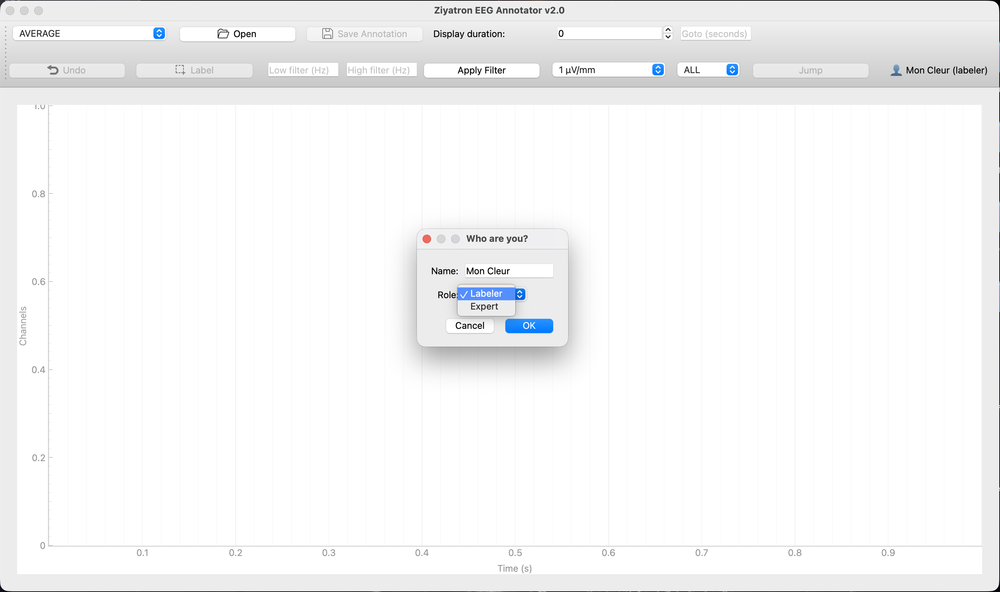

### First run

The first time you launch the app, you are asked for:

- **Name** — recorded as the `author` of annotations you create and the `reviewer` of labels you verify.
- **Role** — one of:
  - **Labeler** — draws and edits annotations (the default).
  - **Expert** — can also review other people's labels (unlocks Review mode, see [Section 8](#8-expert-review-workflow)).

Your choice is remembered across launches.

### Changing your name or role

Click the **👤 user button** on the toolbar (it shows `your name (role)`) at any time to reopen the dialog and change your name or role.

> Switching your role to **Expert** reveals the **Review mode** button on the toolbar. Switching back to **Labeler** hides it.

---

## 3. Interface Overview

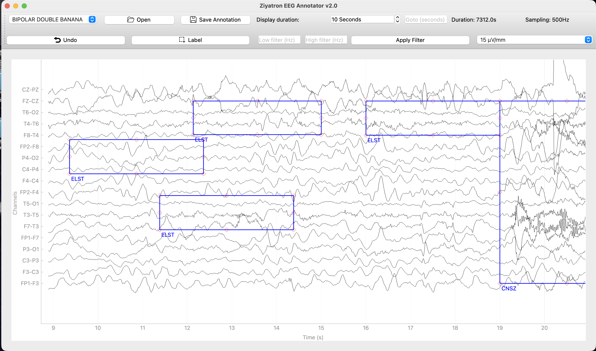

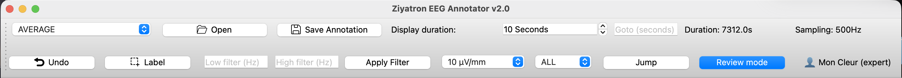

**Toolbar — top row:**
| Control | Purpose |
|---|---|
| Montage dropdown | Switch between electrode configurations |
| Open | Load an EDF file |
| Save Annotation | Write annotations to the recording's JSON file |
| Display duration spinner | Set how many seconds are visible at once |
| Goto (seconds) | Jump to a specific time in the recording |
| Duration / Sampling labels | Shows file length and sampling frequency |

**Toolbar — bottom row:**
| Control | Purpose |
|---|---|
| Undo | Remove the most recently added annotation |
| Label | Enter annotation drawing mode |
| Low filter (Hz) | High-pass filter cutoff |
| High filter (Hz) | Low-pass filter cutoff |
| Apply Filter | Apply the entered filter values |
| Scale (µV/mm) | Adjust vertical amplitude of channels |
| Label dropdown | Filter annotation jumps by type (ALL or specific label) |
| Jump | Center view on nearest annotation matching the selected label |
| **Review mode** *(experts only)* | Show/hide the review panel ([Section 8](#8-expert-review-workflow)) |
| **👤 User button** | Shows your name/role; click to edit ([Section 2](#2-identity-and-roles)) |

**Menu bar:** File → Open EDF, Save Annotations, Exit

---

## 4. Opening an EEG File

1. Click **Open** in the toolbar, or use **Ctrl+O** (Cmd+O on Mac).
2. Select an `.edf` file from the file browser.
3. The recording loads and displays the first 10 seconds.
4. If an annotation file already exists for this recording in the same folder, it is loaded automatically.

> **Note:** Only the visible time window is loaded into memory. The application does not load the entire file at once — it streams data as you navigate.

---

## 5. Navigating the Recording

### Panning

| Method | Action |
|---|---|
| **A** key | Pan left 10 seconds |
| **D** key | Pan right 10 seconds |
| Mouse drag on plot | Pan freely (click and drag on empty area) |
| Scroll wheel | Zoom in/out on the time axis |

### Jumping to a Specific Time

Type a time in seconds into the **Goto** field and press **Enter**. The view jumps to that position.

### Jumping Between Annotations

The annotation jump controls are in the **bottom toolbar row**, to the right of the Scale dropdown:

| Control | Purpose |
|---|---|
| Label dropdown | Filter by annotation type — **ALL** or any specific label (e.g. SEIZ, BCKG) |
| **Jump** button | Center the view on the nearest annotation matching the selected label |
| **← Left arrow** key | Jump to the previous annotation (relative to the last jump position) |
| **→ Right arrow** key | Jump to the next annotation (relative to the last jump position) |

**How it works:**
- Press **Jump** to instantly center the view on the nearest annotation to your current position. This also sets a cursor so that subsequent arrow key presses navigate sequentially from there.
- Press **→** / **←** to step forward or backward through annotations one at a time.
- If no label is selected (ALL), navigation visits every annotation in time order. If a specific label is selected, only annotations with that label are visited.
- If you have not yet pressed Jump, the first arrow key press behaves like Jump (jumps to nearest), then subsequent presses step from there.

> The Jump button is enabled only after a file is loaded.

### Changing the Visible Window

Use the **Display duration** spinner to set how many seconds are shown at once (minimum 5 s, maximum half the total recording duration). The view re-centers on your current position.

---

## 6. Display Settings

### Montage

Select the electrode configuration from the montage dropdown. Available montages:

| Montage | Description |
|---|---|
| **AVERAGE** | Each electrode referenced to the average of all electrodes. 19 channels + ECG. |
| **BIPOLAR DOUBLE BANANA** | Sequential longitudinal bipolar pairs (FP1-F3, F3-C3, … standard clinical layout, 18 channels). |
| **BIPOLAR TRANSVERSE** | Lateral bipolar pairs across both hemispheres (18 channels). |

> Changing the montage reloads the data and redraws all annotations automatically. Your current time position is preserved. Annotations are **montage-specific**: each montage has its own set of labels (see [Section 10](#10-saving-and-loading-annotations)).

### Amplitude Scale

The **Scale** dropdown sets vertical sensitivity in µV/mm. Available values:

`1 · 2 · 5 · 7 · 10 · 15 · 20 · 50 · 70 · 100 · 200 · 500 · 1000 µV/mm`

Lower values (e.g., 1 µV/mm) make signals appear taller. Higher values (e.g., 1000 µV/mm) compress them.

### Filtering

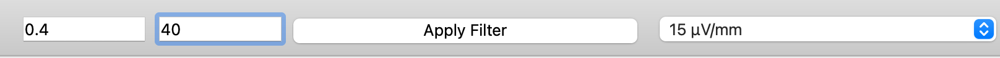

Enter frequency values in the **Low filter** and **High filter** fields, then click **Apply Filter**:

| Field | Effect |
|---|---|
| Low filter (Hz) | High-pass filter — removes slow drift below this frequency |
| High filter (Hz) | Low-pass filter — removes high-frequency noise above this frequency |
| Both empty | No filter applied |
| Low filter only | High-pass only |
| High filter only | Low-pass only |

> Applying a filter reloads the data. Your current time position is preserved.

---

## 7. Annotation Workflow

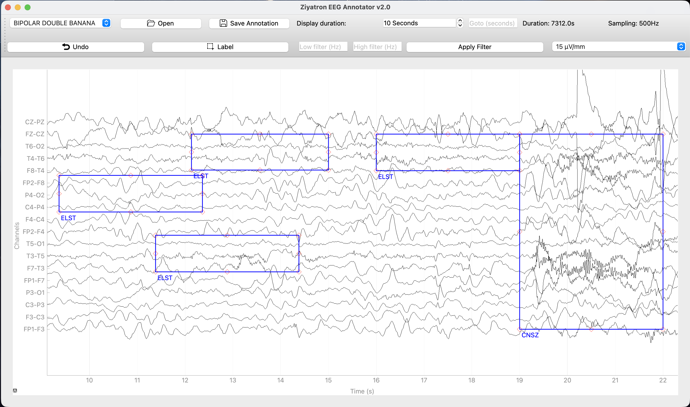

### 7.1 Drawing a New Annotation

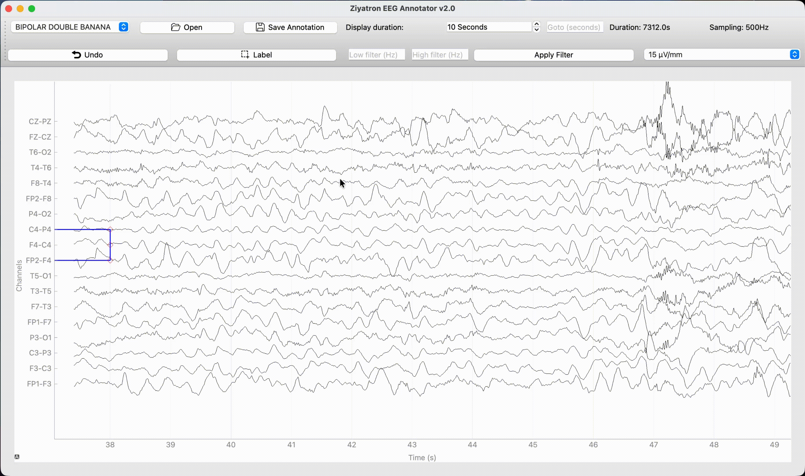

1. Click the **Label** button in the toolbar (or press **L**). The cursor changes to a crosshair and the Label button becomes highlighted — you are now in drawing mode.
2. **Click and drag** on the plot to draw a rectangle over the region of interest. You can span multiple channels vertically and any time range horizontally.
3. Release the mouse button. The rectangle is created with the default label **BCKG**.
4. Drawing mode exits automatically after each annotation.

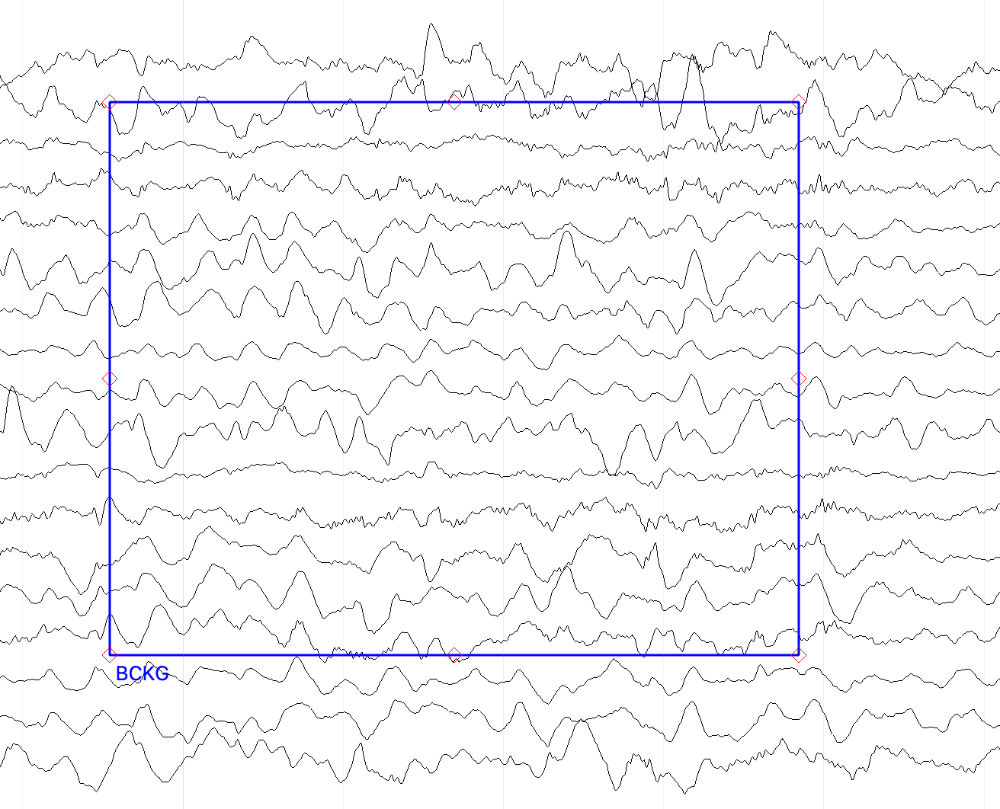

> **Minimum size:** The rectangle must be at least 0.2 seconds wide and span at least half a channel height. Clicks without dragging are ignored.

> **To cancel drawing** before releasing: press **Escape**.

**Time vs. channels:**
- **Time (horizontal)** is recorded at full precision — your annotation can start and end at fractions of a second (e.g. 12.34 s to 15.78 s). Nothing is rounded to whole seconds.
- **Channels (vertical)** are discrete — an annotation either covers a channel or it doesn't. As you draw, move, or resize, the top and bottom edges **snap to channel borders** so the box always straddles exactly the channels it covers.

### 7.2 Annotation Colors (Review Status)

Each annotation's **border color** shows its review status:

| Color | Status | Meaning |
|---|---|---|
| ⚪ Grey | Draft | Created or edited, not yet saved/submitted |
| 🔵 Blue | Submitted | Saved by a labeler, awaiting expert review |
| 🟢 Green | Verified | Approved by an expert |
| 🔴 Red | Rejected | Rejected by an expert |
| 🟣 Purple | Needs changes | An expert asked for edits |
| 🟠 Orange | *(selected)* | The annotation is currently selected (temporary highlight) |

See [Section 8](#8-expert-review-workflow) for the full review lifecycle.

### 7.3 Changing an Annotation's Label

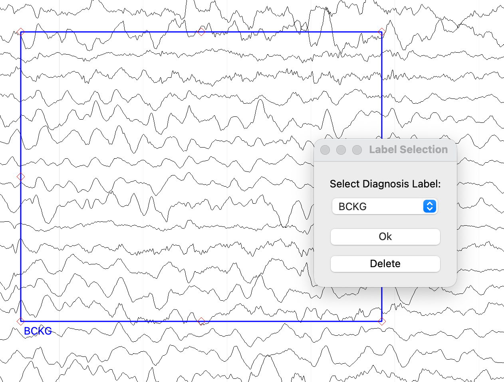

**Right-click** any annotation rectangle. A dialog opens with:
- A dropdown listing all 49 diagnosis labels
- **OK** — apply the selected label
- **Delete** — remove this annotation entirely

> Editing an annotation that an expert had already reviewed sends it back to **Draft** so it gets reviewed again (the reviewer's note is kept).

### 7.4 Moving and Resizing Annotations

- **Drag the body** of a rectangle to move it.
- **Drag any handle** (small squares on the edges and corners) to resize it.
- Movement is constrained to the plot boundaries (0 to end of recording).
- Vertical edges snap to channel borders; horizontal (time) edges move freely.

### 7.5 Selecting an Annotation

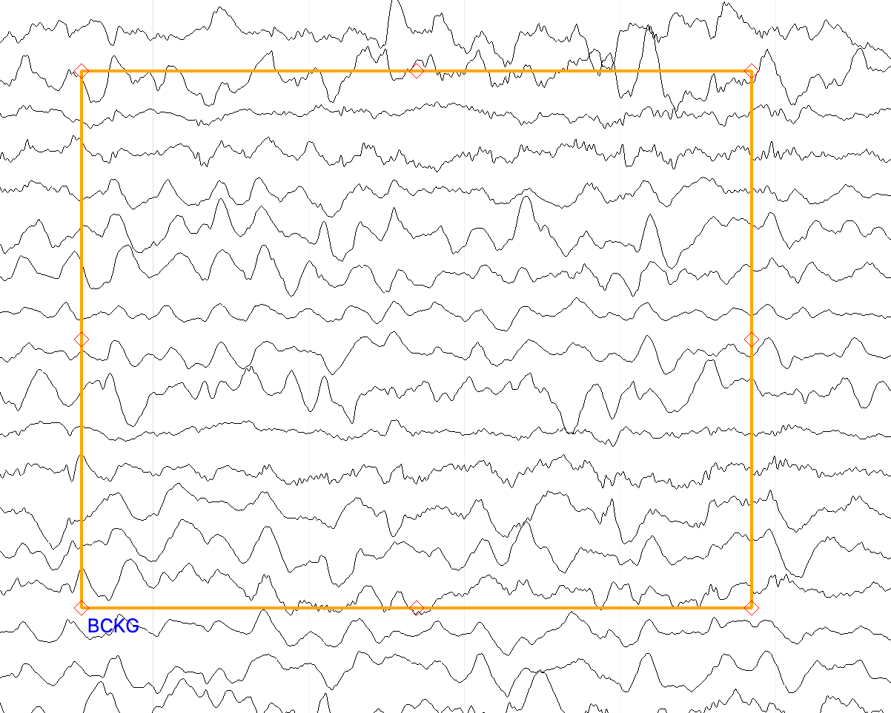

**Left-click** any annotation rectangle. Its border turns **orange** to indicate it is selected. Only one annotation can be selected at a time. Click on empty plot space to deselect.

> Selecting an annotation also populates the **Review panel** when an expert has Review mode on ([Section 8](#8-expert-review-workflow)).

### 7.6 Copying and Pasting Annotations

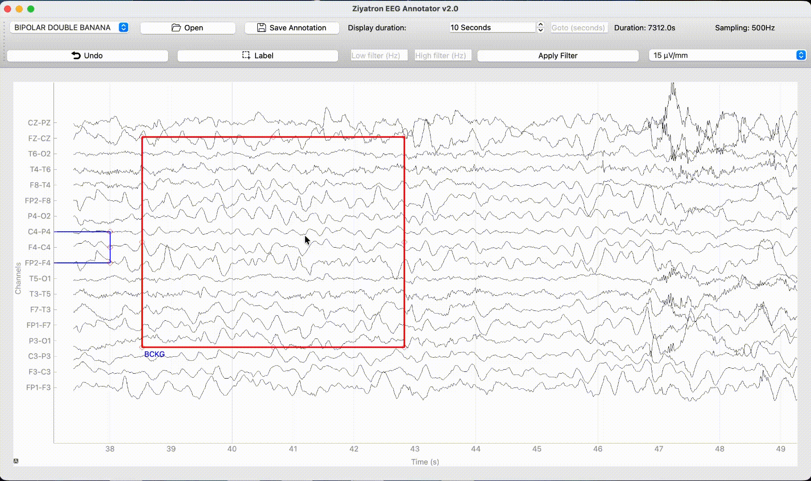

1. **Left-click** the annotation you want to copy (it turns orange).
2. Press **Ctrl+C** (Cmd+C on Mac) to copy it.
3. Move your mouse cursor to the desired time position in the plot.
4. Press **Ctrl+V** (Cmd+V on Mac) to paste.

The pasted annotation keeps the original's label, channels, and duration, but starts at the current cursor X position. It is a **new** annotation (its own author and a fresh Draft status) — it does not inherit the original's review verdict.

> **Notes:**
> - You can paste multiple times from the same copy.
> - If the pasted annotation would extend beyond the end of the recording, it is clamped to fit.
> - If the copied channels are not present in the current montage, the paste is silently skipped.

### 7.7 Deleting Annotations

| Method | Action |
|---|---|
| Right-click → Delete | Deletes the right-clicked annotation |
| Hover over annotation + **Delete** or **Backspace** | Deletes the annotation under the cursor |
| **Ctrl+Z** (Cmd+Z on Mac) or **Undo** button | Removes the most recently added annotation |

> The **Undo** button is enabled only when at least one annotation exists. It removes the last-added annotation, not the last-modified one.

> Deletions are only persisted when you **Save**. If you delete every annotation in a montage, saving correctly records the now-empty montage.

---

## 8. Expert Review Workflow

This section applies to users whose role is **Expert** ([Section 2](#2-identity-and-roles)). Labelers can skip it.

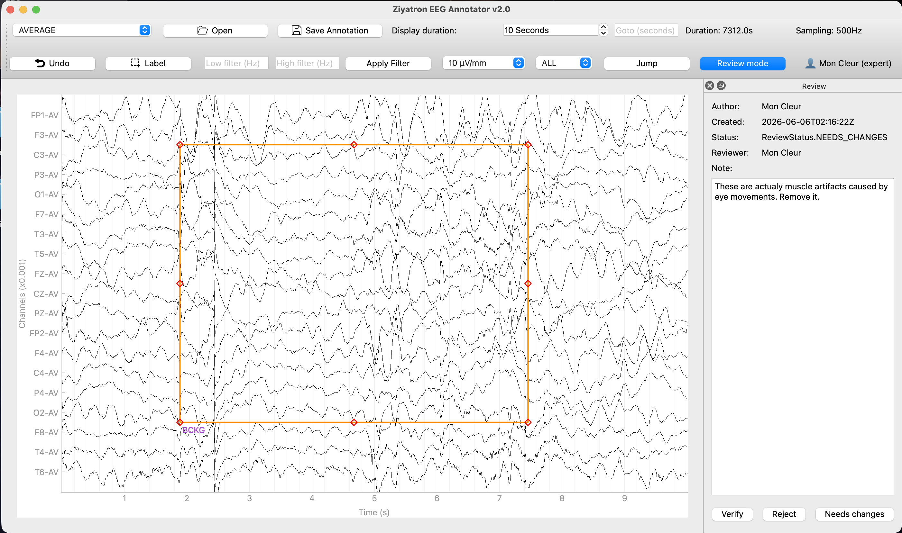

### 8.1 Turning on Review mode

Click the **Review mode** button in the toolbar (visible only to experts). A **Review** panel appears docked on the right side of the window. Click the button again to hide it.

### 8.2 Reviewing a label

1. **Left-click** an annotation on the plot to select it. The Review panel fills in:
   - **Author** — who created the annotation
   - **Created** — when it was created
   - **Status** — its current review status
   - **Reviewer** — who last reviewed it (if anyone)
   - **Note** — an editable field for your feedback
2. Optionally type a **note** (e.g. "onset is 2 s too early").
3. Click one of:
   - **Verify** — approve the annotation (border turns green).
   - **Reject** — reject it (border turns red).
   - **Needs changes** — send it back to the labeler for edits (border turns purple).

Your name is recorded as the **reviewer** along with the time of the verdict.

### 8.3 The review lifecycle

```
draft ──save──▶ submitted ──┬─▶ verified
                            ├─▶ rejected
                            └─▶ needs changes ──labeler edits──▶ draft ──▶ …
```

- A new annotation starts as **draft**. When the labeler saves, their drafts become **submitted** (awaiting review).
- An expert verdict moves it to **verified**, **rejected**, or **needs changes**.
- If a labeler later **edits** an already-reviewed annotation, it drops back to **draft** (the reviewer's note is kept) so it is reviewed again.

> Reviews are stored alongside the annotations in the recording's JSON file ([Section 10](#10-saving-and-loading-annotations)). Verdicts on one montage never affect another montage's labels.

---

## 9. Annotation Labels Reference

The following 49 labels are available in the label selection dialog:

### Background / General
| Label | Meaning |
|---|---|
| **BCKG** | Background (default label for new annotations) |
| **ARTF** | Artifact (general) |
| **INTR** | Intrusion |
| **SLOW** | Slowing |
| **KCOMP**| K-complexes |
| **SLPSP**| Sleep spindles (often referred to as "veretena" or "spindles" in EEG literature) |
| **VERX** | Vertex sharp waves (V waves) |

### Rhythmic Patterns
| Label | Meaning |
|---|---|
| **AR** | Alpha rhythm |
| **BR** | Beta rhythm |
| **TR** | Theta rhythm |
| **DR** | Delta rhythm |
| **MR** | Mu rhythm |
| **AOR** | Alpha-like overdose rhythm |
| **DSR** | Delta slow rhythm |
| **PHS** | Photic stimulation |
| **SHW** | Spike-and-wave (high frequency) |
| **SPW** | Spike-and-wave |
| **GED** | Generalized epileptiform discharge |
| **LED** | Lateralized epileptiform discharge |
| **HPHS** | Hypsarrhythmia |
| **TRIP** | Triphasic waves |
| **6SP** | 6 Hz positive spikes (also known as "phantom spike-and-wave" or ctenoids) |
| **HYPHYP** | Hypnagogic Hypersynchrony

### Eye / Muscle Artifacts
| Label | Meaning |
|---|---|
| **EYBL** | Eye blink |
| **EYEM** | Eye movement |
| **CHEW** | Chewing artifact |
| **SHIV** | Shivering artifact |
| **MUSC** | Muscle artifact |
| **EMA** | Electrode/movement artifact |
| **ELST** | Electrical stimulation |

### Seizure Types
| Label | Meaning |
|---|---|
| **SEIZ** | Seizure (general) |
| **FNSZ** | Focal non-specific seizure |
| **GNSZ** | Generalized non-specific seizure |
| **SPSZ** | Simple partial seizure |
| **CPSZ** | Complex partial seizure |
| **ABSZ** | Absence seizure |
| **TNSZ** | Tonic seizure |
| **CNSZ** | Clonic seizure |
| **TCSZ** | Tonic-clonic seizure |
| **ATSZ** | Atonic seizure |
| **MYSZ** | Myoclonic seizure |
| **NESZ** | Non-epileptic seizure |

### SSW / Patterns
| Label | Meaning |
|---|---|
| **ASSA** | Asymmetric SSW (type A) |
| **BSSA** | Bilateral SSW (type B) |
| **TSSA** | Temporal SSW |
| **DSSA** | Diffuse SSW |
| **NDAR** | Non-diagnostic abnormal rhythm |
| **CALB** | Calibration |
| **IFCN** | IFCN standard |

---

## 10. Saving and Loading Annotations

### Saving

Click **Save Annotation** in the toolbar or press **Ctrl+S** (Cmd+S on Mac).

Annotations are saved to a single JSON file in the **same folder as the EDF file**, named:
```
{edf_filename}.ziyatron.json
```
Example: `patient_01.ziyatron.json`

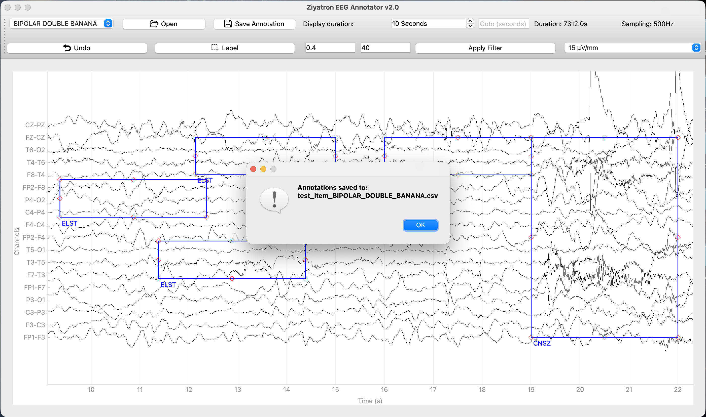

> **One file per recording.** All montages for a recording share this one file. Saving while on one montage **never** affects another montage's annotations — they are merged, not overwritten. The same is true for review verdicts: a labeler's save can't erase an expert's decision on a different montage.

### Switching montage with unsaved changes

If you change the montage while you have unsaved annotations, a dialog asks whether to **Save**, **Don't Save**, or **Cancel** before switching. Choosing **Save** writes the current montage's annotations (including the case where you deleted all of them) before loading the new montage.

### Automatic Loading

When you open an EDF file, the application automatically looks for `{edf_filename}.ziyatron.json` in the same folder. If found, the annotations for the **current montage** are loaded and displayed.

> If a JSON file is hand-edited into an invalid state, the app shows a warning instead of loading it, so a typo can't silently lose your data.

### What's stored

Each annotation is one object that records:

| Field | Description |
|---|---|
| `id` | Unique identifier |
| `montage` | The montage it was drawn under |
| `channels` | The list of channels it covers (e.g. `["FP1-AV", "F7-AV"]`) |
| `start_time` / `stop_time` | Start and end in seconds (full precision, not rounded) |
| `onset` | Diagnosis label (e.g. `SEIZ`) |
| `author` | Who created it |
| `created_at` / `modified_at` | Timestamps |
| `review` | Review block: `status`, `reviewer`, `reviewed_at`, `note` |

> **Unsaved work is not kept on close.** Closing the window discards in-memory annotations without prompting — remember to **Save** (Ctrl+S) first.

---

## 11. Keyboard Shortcuts Reference

### Navigation

| Shortcut | Action |
|---|---|
| **A** | Pan left 10 seconds |
| **D** | Pan right 10 seconds |
| **Enter** (in Goto field) | Jump to typed time position |
| **→ Right arrow** | Jump to next annotation (filtered by label dropdown) |
| **← Left arrow** | Jump to previous annotation (filtered by label dropdown) |
| Mouse drag | Pan freely |
| Scroll wheel | Zoom in / out |

### File Operations

| Shortcut | Action |
|---|---|
| **Ctrl+O** / **Cmd+O** | Open EDF file |
| **Ctrl+S** / **Cmd+S** | Save annotations |
| **Ctrl+Q** / **Cmd+Q** | Exit application |

### Annotation Drawing

| Shortcut | Action |
|---|---|
| **L** | Toggle annotation drawing mode on/off |
| **Escape** | Cancel drawing (exit drawing mode) |
| Click + drag | Draw annotation rectangle (while in drawing mode) |

### Annotation Editing

| Shortcut | Action |
|---|---|
| Left-click annotation | Select annotation (orange border) |
| Right-click annotation | Open label / delete dialog |
| **Ctrl+C** / **Cmd+C** | Copy selected annotation |
| **Ctrl+V** / **Cmd+V** | Paste annotation at current cursor position |
| **Delete** or **Backspace** | Delete annotation under mouse cursor |
| **Ctrl+Z** / **Cmd+Z** | Undo last annotation |

---

*Ziyatron EEG Annotator v2.0 — built with PyQt6 and PyQtGraph*
