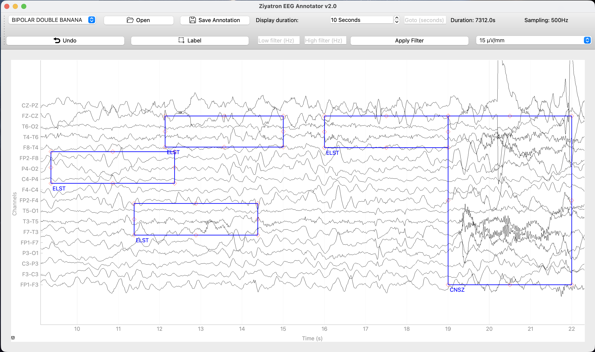
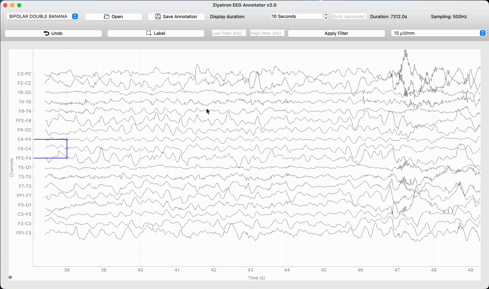

# Ziyatron EEG Annotator

**Clinical-grade EEG annotation for neurophysiologists — fast, free, and runs on any laptop.**




Load any EDF file, navigate the trace, and mark regions with 44 clinical labels — all without a hospital workstation. Streams data on demand so 100 MB+ files open in seconds and use under 50 MB of RAM.

---

## Download

> **No installation required — just unzip and run.**

**[Download the latest release](https://github.com/warptengood/eeg_annotator/releases/latest)** — pre-built executables for Windows and macOS.

---

## Features

**Viewing**
- Load EDF / EDF+ files of any size (tested up to 1 GB+)
- Bipolar Double Banana, Bipolar Transverse, and Average montages
- Adjustable scale (1–1000 µV/mm), high-pass / low-pass filtering
- Smooth pan with A/D keys or mouse drag; zoom with scroll wheel
- Jump to any time with the Goto field

**Annotation**
- Draw rectangles across any time range and channel selection
- 44 pre-defined clinical labels (SEIZ, ARTF, AR, MUSC, EYBL, …)
- Move, resize, copy/paste, and delete annotations
- Ctrl+Z undo



**File I/O**
- Annotations auto-save as CSV next to the EDF file
- Auto-loads existing annotation file on open
- One CSV per montage; backward-compatible with v1.0

---

## User Manual

Full usage instructions, keyboard shortcuts, and label reference: **[MANUAL.md](MANUAL.md)**

---

## Quick Start (from source)

```bash
git clone https://github.com/warptengood/eeg_annotator.git
cd eeg_annotator
pip install -r requirements.txt
python main.py
```

> Always run `python main.py` from the project root — not `python src/main.py`.

---

## Built With

- [MNE-Python](https://mne.tools/) — EEG data I/O
- [PyQt6](https://www.riverbankcomputing.com/software/pyqt/) — GUI framework
- [PyQtGraph](https://www.pyqtgraph.org/) — high-performance time-series rendering

---

## Contributing

See [CONTRIBUTING.md](CONTRIBUTING.md) for dev setup, architecture, and how to add montages or labels.

---

## Support

- Bug reports & feature requests: [GitHub Issues](https://github.com/warptengood/eeg_annotator/issues)
- Email: kenesyerassyl@gmail.com

---

*Ziyatron EEG Annotator v2.0 · GPL-3.0 · by Kenes Yerassyl*
